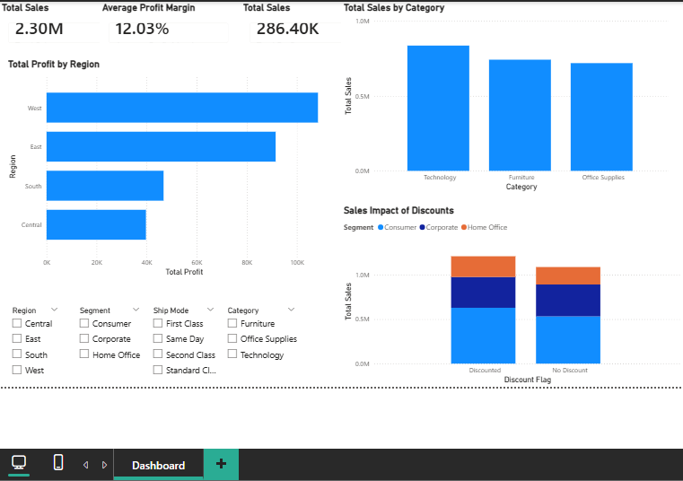
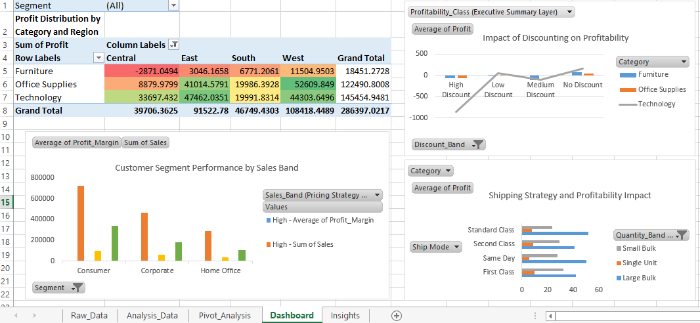

# Sales & Profitability Dashboard Portfolio (Excel + Power BI)

Welcome to my data analytics portfolio focused on building interactive dashboards and business reports using Microsoft Excel and Power BI.

This repository showcases an end-to-end sales and profitability analysis project using the same dataset across Excel and Power BI to demonstrate data preparation, analysis, and visualization skills.

The project highlights my ability to transform raw transactional data into decision-ready insights for business stakeholders.

This portfolio is aligned for entry-level roles such as:
Data Analyst | Business Analyst | Marketing Analyst | Business Intelligence Analyst

##  Tools & Technologies
- Microsoft Excel (Advanced formulas, Pivot Tables, Data Cleaning, Data Validation)
- Power BI (Power Query, Data Modeling, DAX, KPI Dashboards, Interactive Visuals)

## Project Overview

### Sales & Profitability Dashboard

**Objective:**  
Analyze retail sales transaction data to evaluate revenue performance, profitability drivers, and regional trends using Excel and Power BI.

The same dataset is analyzed in both Excel and Power BI to demonstrate tool flexibility and analytical depth.

##  Dataset Overview
- Records: 10,000+ retail transaction rows
- Data includes:
  - Order date
  - Region
  - Product category
  - Sales amount
  - Profit
  - Discount
  - Shipping mode
  - Customer segment

##  Analysis Performed
- Data cleaning and formatting in Excel
- Handling missing values and inconsistent entries
- Feature engineering (profit margin %, discount classification)
- Pivot table analysis for category and regional performance
- KPI calculations for total sales, total profit, and average margin
- Power BI dashboard creation with slicers and filters

##  Dashboard Features
- KPI cards for:
  - Total Sales
  - Total Profit
  - Average Profit Margin
- Regional profitability comparison
- Category-wise sales and profit breakdown
- Interactive slicers for dynamic filtering
- Trend analysis visuals

##  Key Insights 
- Generated total sales of 2.30M with overall profit of 286.40K and an average profit margin of 12.03% across all transactions.
- West region emerged as the highest profit contributor, significantly outperforming Central and South regions.
- Technology category delivered the strongest profitability, while Furniture showed lower margins and even negative profit in certain regions, indicating pricing or discount inefficiencies.
- High discount levels were strongly correlated with reduced profitability, with heavy discounting leading to negative margins in multiple product categories.
- First Class shipping demonstrated higher profitability for large bulk orders, whereas Same Day delivery showed comparatively lower margins.

##  Business Use Cases
- Supports pricing optimization decisions
- Enables management to identify profitable markets and product lines
- Assists marketing teams in targeting high-margin segments
- Helps leadership monitor business KPIs quickly

##  Project Files
- Excel workbook with cleaned data and pivot analysis
- Power BI (.pbix) dashboard file
- Dataset files
- Screenshots of dashboards

##  Learning Outcomes
- Advanced Excel analytics and structuring
- Power BI dashboard design and data modeling
- Business storytelling through visuals
- KPI-driven reporting mindset

##  Contact
LinkedIn: https://www.linkedin.com/in/bhoomi-gupta-67a669281/  
GitHub: https://github.com/BhoomiGupta19

##  Dashboard Preview

